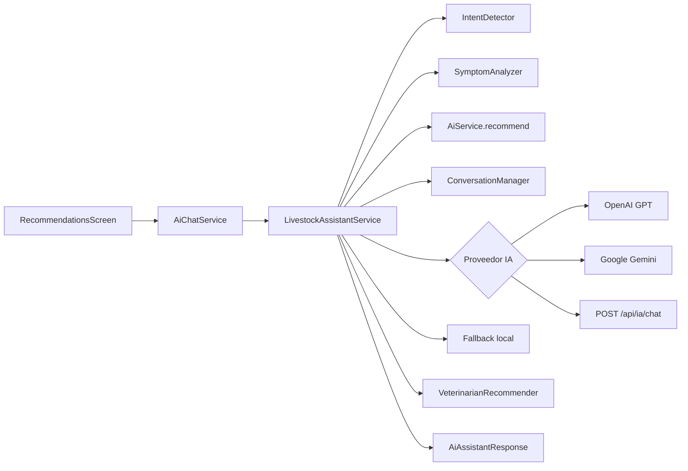

# Módulo de IA — SmartFarm AI

Asistente ganadero conversacional con OpenAI GPT / Google Gemini, especializado en salud animal, nutrición y apoyo veterinario orientativo.

> Configuración de API keys: ver [AI_SETUP.md](./AI_SETUP.md)

## Arquitectura

```
lib/ai/
├── config/           # ai_config.dart — proveedor y claves (--dart-define)
├── models/           # Respuestas estructuradas, intención, riesgo, chat
├── knowledge/        # Base de conocimiento (enfermedades, directorio vets)
├── services/
│   ├── openai_chat_provider.dart    # Integración GPT REST
│   ├── gemini_chat_provider.dart    # Integración Gemini REST
│   ├── backend_chat_provider.dart   # Proxy backend seguro
│   ├── cloud_ai_provider_factory.dart
│   ├── conversation_manager.dart    # Memoria temporal (12 msgs)
│   ├── prompt_builder.dart          # System prompt profesional
│   ├── intent_detector.dart
│   ├── symptom_analyzer.dart
│   ├── veterinarian_recommender.dart
│   └── livestock_assistant_service.dart  # Orquestador principal
└── widgets/          # UI del chat (categorías, tarjetas estructuradas)

backend/src/ai/
├── aiService.js              # Orquestador backend
├── promptManager.js          # Prompts del sistema
├── conversationManager.js    # Historial conversacional
├── recommendationEngine.js   # Base conocimiento + síntomas
└── veterinaryAssistant.js    # Recomendación veterinarios

lib/services/
├── ai_service.dart           # Recomendaciones nutricionales (sin cambios)
└── ai_chat_service.dart      # Fachada del chat
```

## Flujo de una consulta



1. El usuario escribe o elige una categoría rápida.
2. Se carga contexto del animal (peso, historial, raciones).
3. Se detecta intención (síntomas, nutrición, emergencia, etc.).
4. Se analizan síntomas contra la base de conocimiento.
5. Se envía historial + contexto a IA en la nube (JSON estructurado).
6. Si falla o no hay clave → motor local enriquecido.
7. Se adjuntan veterinarios sugeridos según especie y riesgo.

## Respuesta estructurada

| Campo | Descripción |
|-------|-------------|
| `summary` | Respuesta principal conversacional |
| `probableAssessment` | Evaluación orientativa (no diagnóstico) |
| `detectedSymptoms` | Síntomas identificados en la consulta |
| `riskLevel` | bajo / medio / alto / emergencia |
| `recommendations` | Acciones prácticas |
| `prevention` | Cuidados preventivos |
| `whenToSeeVet` | Cuándo escalar a profesional |
| `veterinarians` | Especialistas sugeridos (demo) |
| `cloudProviderName` | OpenAI GPT / Google Gemini / SmartFarm API |

## Memoria conversacional

- Historial en memoria durante la sesión del chat
- Últimos 12 mensajes enviados a la API (optimización de tokens)
- Continuidad entre preguntas del mismo hilo
- Botón "Limpiar historial" reinicia la conversación

## Seguridad y responsabilidad

- Disclaimer visible en UI y en cada respuesta
- Sin diagnósticos definitivos; lenguaje orientativo
- Detección de emergencias → urgencias veterinarias
- API keys en `--dart-define` (cliente) o `.env` (backend)
- Fallback local si no hay clave o falla la API
- Validación de entrada (max 2000 caracteres)

## Base de conocimiento

Archivo: `lib/ai/knowledge/livestock_knowledge.dart`

Incluye condiciones comunes (mastitis, diarrea, respiratorio, cojera, parasitosis, etc.) con:
- especies aplicables
- síntomas clave
- cuidados básicos
- prevención
- cuándo consultar veterinario

## Veterinarios

Archivo: `lib/ai/knowledge/veterinarian_directory.dart`

Directorio demo integrable con Google Maps / API externa. Especialidades: bovinos, porcinos, aves, ovinos/caprinos, urgencias 24h.

## Configuración rápida

```bash
# Cliente con OpenAI
flutter run --dart-define=OPENAI_API_KEY=sk-...

# Backend + app remota
OPENAI_API_KEY=sk-...  # en backend/.env
flutter run --dart-define=USE_REMOTE_BACKEND=true --dart-define=API_BASE_URL=http://10.0.2.2:3000
```

Ver [AI_SETUP.md](./AI_SETUP.md) para instrucciones completas.

## Mejoras futuras

- Integración Google Maps para veterinarios cercanos
- Persistencia del historial de chat en SQLite
- Fine-tuning con datos ganaderos regionales
- Streaming de respuestas (SSE)
- Notificaciones push para recordatorios de vacunas
